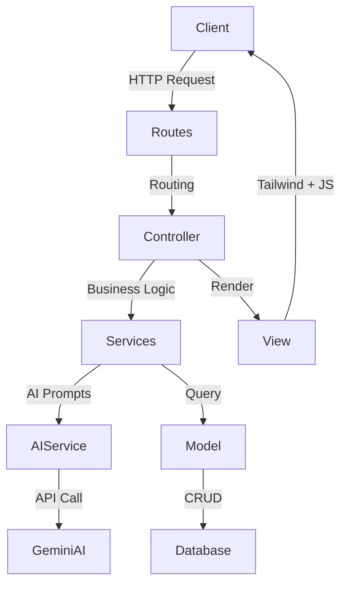

<div align="center">

# 🚀 NexaTask AI

*The Next-Generation AI-Powered Agile Management Platform*

Elevate your productivity with an intelligent workspace that plans, breaks down, and organizes your sprints using the power of Gemini AI.

[](#)
[](#)
[](#)
[](#)
[](#)
[](#)
[](#)

</div>

---

## 📖 Project Overview

**NexaTask AI** is an advanced task management and agile sprint planning application built for modern development teams and solo creators. 

**The Problem:** Traditional project management tools require heavy manual input. Breaking down complex features into actionable tasks, planning sprints, and maintaining a healthy backlog can drain hours of productive time.

**The Solution:** By integrating cutting-edge Artificial Intelligence directly into the workflow, NexaTask AI acts as an autonomous project manager. Simply describe your feature, and the AI will analyze it, generate user stories, and map out a comprehensive sprint plan automatically.

**Target Users:** Software Engineers, Product Managers, Agile Teams, and Startup Founders who want to move faster and focus on execution rather than planning.

---

## ✨ Features

- [x] 🤖 **AI-Driven Workflows:** Seamless Gemini AI integration.
- [x] 📊 **Interactive Kanban Boards:** Drag-and-drop task management.
- [x] 🏃 **Agile Sprint Planning:** Create, manage, and track sprints.
- [x] 📋 **Smart Backlog Management:** Auto-prioritize and refine backlog items.
- [x] 🔐 **Secure Authentication:** Robust role-based access control.
- [x] ⚡ **Real-Time UI Updates:** Powered by Vite and seamless JS integration.
- [x] 🎨 **Responsive Design:** Beautifully crafted with TailwindCSS.

---

## 🧠 AI Features

At the core of this project is a sophisticated AI engine designed to eliminate manual project planning.

> **💡 AI Prompt Workflow**
> The system utilizes a multi-stage prompt engineering pipeline that sanitizes user input, contextually enriches the prompt with current project data, and interfaces with the Gemini AI model to return structured, deterministic JSON payloads.

<details>
<summary><b>Click to explore AI Capabilities</b></summary>

| Capability | Description |
| :--- | :--- |
| **AI Task Breakdown** | Converts high-level feature requests into granular, technical tasks. |
| **Agile Sprint Planning** | Auto-allocates tasks into sprints based on estimated effort and velocity. |
| **Backlog Generation** | Identifies missing prerequisites and auto-populates the backlog. |
| **Feature Analysis** | Scans feature descriptions for edge cases and suggests acceptance criteria. |
| **User Story Generation** | Writes professional "As a [user], I want to [action] so that [value]" stories. |
| **Smart Recommendations** | Recommends optimal tech stacks or architectural patterns for specific tasks. |
| **Automatic Planning** | Creates timelines and milestones instantly. |
| **Gemini AI Integration** | Fully integrated with Google's powerful Gemini multimodal LLM. |

</details>

---

## 🏗️ Architecture

The application follows a strict, modern **Model-View-Controller (MVC)** design pattern, enriched with Service classes for clean code abstraction.



- **MVC Core:** Standard Laravel architecture for predictable, maintainable routing, database interaction, and view rendering.
- **Authentication:** Built-in Laravel authentication scaffolds ensuring secure session management.
- **Services Layer:** Isolates complex business logic (like Sprint calculations) from Controllers.
- **AI Service:** A dedicated, abstract layer interacting specifically with the Gemini API to handle rate limits, retries, and JSON parsing.
- **Frontend Flow:** Blade templates injected with dynamic JavaScript modules, bundled ultra-fast via Vite.

---

## 📂 Project Structure

```text
├── app/
│   ├── Http/Controllers/   # Request handlers
│   ├── Models/             # Database schemas & ORM
│   └── Services/           # Business & AI Logic (AIService.php)
├── bootstrap/              # App bootstrapping
├── config/                 # Environment configurations
├── database/               # Migrations & Seeders
├── public/                 # Publicly accessible assets
├── resources/
│   ├── css/                # Tailwind styles
│   ├── js/                 # JavaScript logic
│   └── views/              # Blade templates
├── routes/                 # Web and API routing
└── tests/                  # PHPUnit/Pest testing suites
```

---

## 🛠️ Tech Stack

| Category | Technology | Role |
| :--- | :--- | :--- |
| **Backend Framework** | Laravel | Core MVC framework, routing, ORM |
| **Language** | PHP | Backend scripting and logic |
| **Language** | JavaScript | Dynamic frontend interactivity |
| **Styling** | TailwindCSS | Utility-first CSS framework |
| **Templating** | Blade | Laravel server-side templating |
| **Database** | MySQL | Relational data storage |
| **Bundler** | Vite | Lightning-fast asset compilation |
| **Intelligence** | Gemini AI | LLM for automated planning |
| **Version Control** | Git & GitHub | Source code management |

---

## 🚀 Installation

Follow these steps to get the project up and running in your local development environment.

```bash
# 1. Clone the repository
git clone https://github.com/yourusername/nexatask-ai.git

# 2. Navigate to the directory
cd nexatask-ai

# 3. Install PHP dependencies
composer install

# 4. Install Node dependencies
npm install

# 5. Setup environment variables
cp .env.example .env

# 6. Generate application key
php artisan key:generate

# 7. Run database migrations
php artisan migrate

# 8. Compile frontend assets
npm run dev

# 9. Start the local development server (in a new terminal)
php artisan serve
```

---

## 🔐 Environment Variables

To run this project securely, you will need to configure your `.env` file.

| Variable | Description | Required |
| :--- | :--- | :--- |
| `APP_NAME` | The name of the application | Yes |
| `APP_ENV` | Environment (local, production) | Yes |
| `DB_CONNECTION` | Database type (mysql, sqlite) | Yes |
| `DB_HOST`, `DB_PORT` | Database connection details | Yes |
| `GEMINI_API_KEY` | **Crucial:** Your Google Gemini API Key | **Yes** |

> **⚠️ Important:** Never commit your `.env` file or expose your `GEMINI_API_KEY` to public repositories.

---

## 🤖 Using AI (The Magic)

NexaTask AI is more than a CRUD app; it acts as a proactive team member.

### How the AI Works
When you create a new "Feature Idea" in the dashboard, the application does not just save text to a database. It triggers a background process utilizing the `AIService`.

### The Prompting Pipeline
1. **Contextualization:** The system gathers current sprint data, team capacity, and existing backlog items.
2. **Dispatch:** A highly engineered, role-based prompt is sent to the Gemini AI API containing your feature description.
3. **Response Parsing:** The AI returns a strictly formatted JSON response detailing User Stories, Technical Tasks, and estimations.

### Automated Outputs
- **Task Creation:** The JSON is parsed, and `Task` models are instantly created in the database.
- **Backlog Generation:** Items deemed "future scope" are automatically pushed to the Backlog.
- **Sprint Generation:** The AI recommends a Sprint timeline, grouping related tasks logically to maximize developer velocity.
- **Smart Recommendations:** The AI appends comments to complex tasks, suggesting specific Laravel packages or database indexing strategies to save time.

---

## 📸 Screenshots

| Dashboard | AI Assistant |
| :---: | :---: |
|  |  |

| Sprint Planner | Task Board |
| :---: | :---: |
|  |  |

| Backlog | Settings |
| :---: | :---: |
|  |  |

---

## 🗺️ Future Improvements

- [ ] Implement WebSockets for real-time multiplayer board updates.
- [ ] Add GitHub integration (auto-create PRs from Tasks).
- [ ] Support multiple AI providers (OpenAI, Anthropic).
- [ ] Introduce time-tracking and automated timesheet generation.
- [ ] Export Sprints to PDF/CSV for stakeholder reports.

---

## 🛡️ Security

Security is treated as a first-class citizen in this application:
- **Authentication & Authorization:** Handled natively via Laravel's robust gate and policy mechanisms.
- **CSRF Protection:** All forms are protected using `@csrf` token validation.
- **XSS Prevention:** Blade templating engine automatically escapes data `{{ $data }}`.
- **SQL Injection:** Eloquent ORM utilizes PDO parameter binding to completely neutralize SQL injection attacks.
- **API Security:** AI endpoints are rate-limited and require valid API keys.

---

## ⚡ Performance

- **Eager Loading:** To prevent the N+1 query problem, Eloquent relationships are strictly eager-loaded.
- **Vite Bundling:** Frontend assets are minified and served with optimal caching headers.
- **Caching:** AI responses for identical prompts are cached using Redis/File cache to reduce API costs and latency.
- **Queued Jobs:** Heavy AI API calls are offloaded to background queues so the UI remains instantly responsive.

---

## 🤝 Contributing

We welcome contributions from the community!

1. Fork the Project
2. Create your Feature Branch (`git checkout -b feature/AmazingFeature`)
3. Commit your Changes (`git commit -m 'Add some AmazingFeature'`)
4. Push to the Branch (`git push origin feature/AmazingFeature`)
5. Open a Pull Request

*Please ensure your code passes all linting and test suites before submitting.*

---

## 📄 License

Distributed under the **MIT License**. See `LICENSE` for more information.

---

## 🙏 Credits

This project stands on the shoulders of giants:
- [Laravel](https://laravel.com) - The PHP Framework for Web Artisans
- [TailwindCSS](https://tailwindcss.com) - Rapid UI development
- [Gemini AI](https://deepmind.google/technologies/gemini/) - Powering the intelligence
- [Vite](https://vitejs.dev) - Next Generation Frontend Tooling

---

<div align="center">

**Enjoying the project?**

### ⭐ Star this repository if you found it useful! ⭐

</div>
