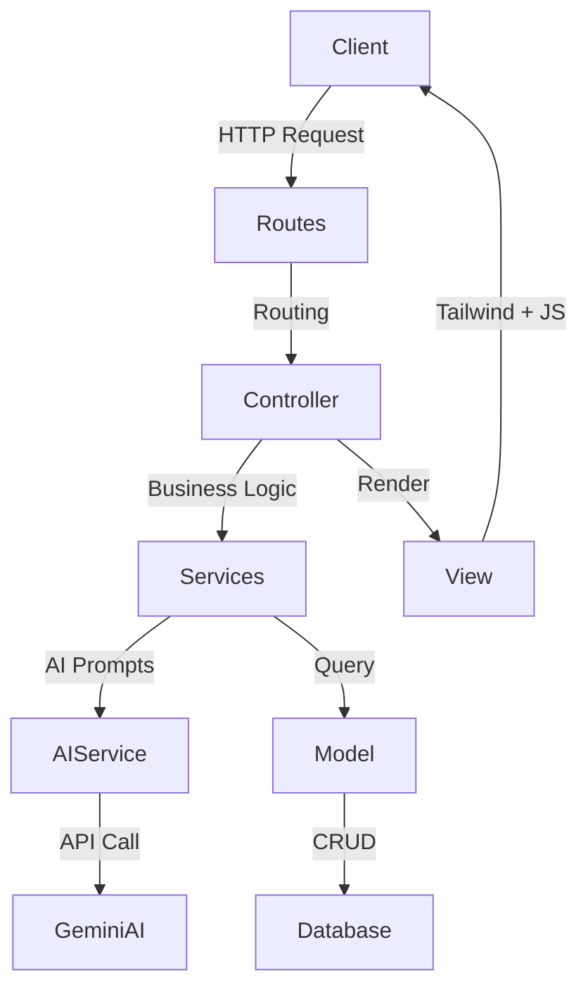

<div align="center">

# 🚀 AI-Powered Agile Project and Task Management System

*The Next-Generation AI-Powered Agile Management Platform*

Elevate your productivity with an intelligent workspace that plans, breaks down, and organizes your sprints automatically using the power of **Gemini AI**.

[](#)
[](#)
[](#)
[](#)
[](#)
[](#)
[](#)

</div>

---

## 📖 Project Overview

**AI-Powered Agile Project and Task Management System** is an advanced task management and agile sprint planning application built for modern development teams and solo creators. 

Traditional project management tools require heavy manual input. Breaking down complex features into actionable tasks, planning sprints, and maintaining a healthy backlog can drain hours of productive time. **AI-Powered Agile Project and Task Management System** solves this by integrating Artificial Intelligence directly into your workflow. Simply describe your feature, and the AI will analyze it, generate technical user stories, and map out a comprehensive sprint plan automatically.

---

## 🛠️ Tech Stack

The application is built using a modern, robust, and scalable tech stack, strictly separating frontend interactions from backend business logic.

### 🎨 Frontend (Client-Side)
- **Tailwind CSS v4:** A utility-first CSS framework for rapidly building custom, responsive, and modern user interfaces.
- **Vite:** A lightning-fast frontend build tool and asset bundler that provides instant server start and Hot Module Replacement (HMR).
- **Vanilla JavaScript:** Used for handling dynamic user interactions, DOM manipulation, and drag-and-drop functionalities without the overhead of heavy frameworks.
- **Laravel Blade:** The powerful, server-side templating engine utilized to render dynamic HTML structures cleanly and efficiently.

### ⚙️ Backend (Server-Side)
- **Laravel (PHP 8.3):** The core MVC framework handling routing, middleware, database ORM (Eloquent), and secure session management.
- **Gemini AI API:** Deeply integrated into the services layer to act as the autonomous project manager (analyzing texts, creating tasks, and organizing sprints).
- **MySQL:** A robust relational database management system for securely storing user data, projects, tasks, and system logs.
- **Laravel Fortify:** A backend authentication implementation for securely managing user registrations, logins, and passwords.

---

## ✨ Key Features

- **🤖 AI-Driven Workflows:** Seamless Gemini AI integration that converts high-level feature requests into granular, technical tasks and professional user stories.
- **📊 Interactive Kanban Boards:** Effortless task management with a smooth, Javascript-powered drag-and-drop interface to update task statuses instantly.
- **🏃 Agile Sprint Planning:** Create, manage, and track sprints. Allocate tasks efficiently based on project timelines and priorities.
- **👥 Team Collaboration:** Invite users, assign roles, and manage project members securely.
- **🔔 Smart Notifications:** Real-time system notifications to keep track of project updates, task assignments, and mentions.
- **🔐 Secure Authentication:** Robust role-based access control ensuring data privacy and secure project isolation.

---

## 🏗️ Architecture & Data Flow

The application follows a strict **Model-View-Controller (MVC)** design pattern, enriched with a dedicated **Services** layer. This abstraction ensures that complex business logic (especially AI integrations) remains completely separated from the Controllers.



---

## 📂 Project Structure

```text
├── app/
│   ├── Http/Controllers/   # Backend Request handlers (Project, Task, Sprint)
│   ├── Models/             # Eloquent Database Models (User, Task, Sprint)
│   └── Services/           # Business & AI Logic (e.g., AIService)
├── bootstrap/              # Application bootstrapping
├── config/                 # Environment and application configurations
├── database/               # Migrations, Factories, and Seeders
├── public/                 # Publicly accessible assets
├── resources/
│   ├── css/                # Tailwind CSS entry points
│   ├── js/                 # Vanilla JS scripts (Modals, Drag & Drop)
│   └── views/              # Frontend Blade templates
├── routes/                 # Application routing (web.php)
└── vite.config.js          # Vite frontend configuration
```

---

## 🤖 The AI Workflow (How it Works)

AI-Powered Agile Project and Task Management System is more than a standard CRUD application; it acts as a proactive team member.

1. **Input:** You create a new "Feature Idea" in the dashboard.
2. **Contextualization:** The `AIService` gathers current sprint data and existing backlog items to build a comprehensive prompt.
3. **Dispatch:** A highly engineered prompt is sent to the **Gemini AI API**.
4. **Processing & Execution:** The AI returns a strictly formatted JSON response. The system automatically parses this data to generate database records for Tasks, sets their priorities, and drafts your upcoming Sprint timeline automatically.

---

## 🚀 Installation & Setup

Follow these steps to set up the project in your local development environment.

### 1. Prerequisites
- PHP >= 8.3
- Composer
- Node.js & NPM
- MySQL Database

### 2. Quick Start
```bash
# Clone the repository
git clone https://github.com/yourusername/AI-Powered Agile Project and Task Management System.git

# Navigate to the project directory
cd AI-Powered Agile Project and Task Management System

# Install PHP dependencies (Backend)
composer install

# Install Node dependencies (Frontend)
npm install

# Copy environment variables file
cp .env.example .env

# Generate application key
php artisan key:generate
```

### 3. Database Setup
Create an empty MySQL database for the project. Then, update your `.env` file with the database credentials:
```env
DB_CONNECTION=mysql
DB_HOST=127.0.0.1
DB_PORT=3306
DB_DATABASE=your_database_name
DB_USERNAME=your_database_user
DB_PASSWORD=your_database_password
```
Run the migrations to build the database schema:
```bash
php artisan migrate
```

### 4. AI Configuration
To enable the AI capabilities, you must obtain an API key from [Google AI Studio](https://aistudio.google.com/) and add it to your `.env` file:
```env
GEMINI_API_KEY=your_gemini_api_key_here
```

### 5. Run the Application
Compile the frontend assets:
```bash
npm run build
# OR for continuous development: npm run dev
```

Start the backend Laravel development server:
```bash
php artisan serve
```
Visit `http://localhost:8000` in your browser.

---

## 🛡️ Security & Performance

- **Protection:** All forms are protected using `@csrf` token validation. XSS prevention is handled natively by the Blade templating engine, and SQL Injection is neutralized via Eloquent ORM parameter binding.
- **Performance:** Database relationships are eager-loaded to prevent N+1 query problems. Frontend assets are minified and optimized via Vite for maximum loading speeds.

---

## 📄 License

Distributed under the **MIT License**.
